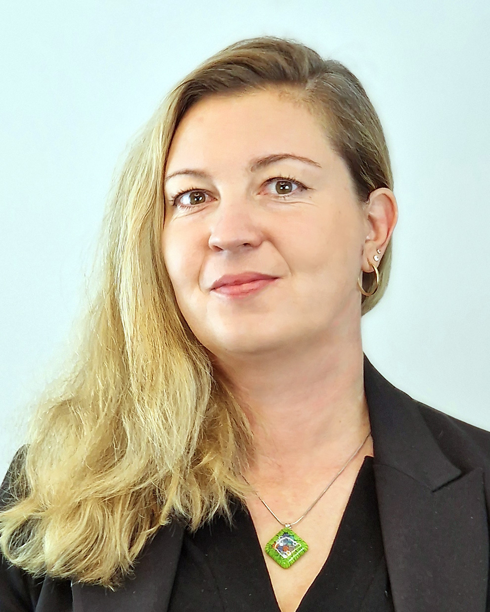

# Our team

    

## Natalia Nechistiak
### Marketing & Sales Expert and Strategic Partner

    

        <a href="mailto:natalia@release.art">
            :email: natalia@release.art
        </a>
    

    

        <a href="https://maps.app.goo.gl/EoMFdXpNpUkUVHHy8">
            :earth_africa: Milton Keynes, United Kingdom
        </a>
    

With over 18 years of experience in marketing and sales, Natalia Nechistiak is a vital contributor to release.art’s mission of bringing practical AI solutions to local businesses. Her extensive background spans customer engagement strategies, digital marketing, and revenue growth, giving her a nuanced understanding of what drives business success in today’s market.

Natalia also brings valuable, real-world insights as the owner of an e-commerce business specializing in rug sales. As an initial customer for release.art’s AI solutions, her business serves as a testing ground for new tools, allowing us to evaluate the true impact of our products in an active commercial setting. This collaboration ensures that each AI solution we develop is not only innovative but genuinely useful in addressing everyday business challenges.

Through her expertise and hands-on experience, Natalia helps us refine our AI-powered tools to better serve our clients, making her an essential part of the release.art team.